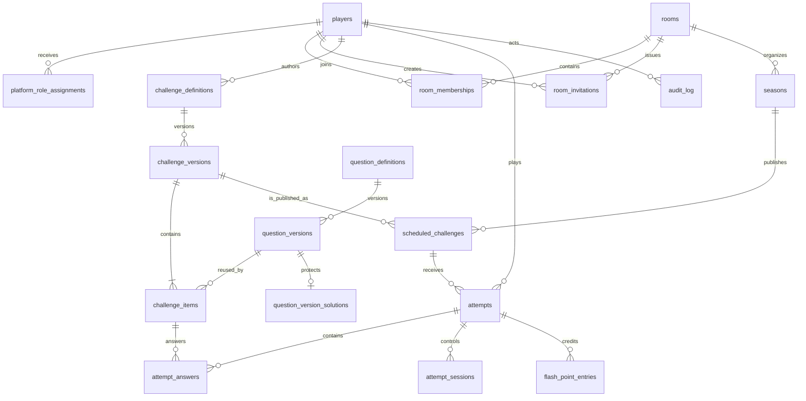

# Modelo de persistencia

## Estado y alcance

- Estado: propuesta de persistencia para la primera versión productiva.
- Fecha: 2026-09-14.
- Infraestructura prevista: PostgreSQL mediante Supabase, Supabase Auth y Supabase Storage.
- Este documento concreta tablas y garantías de almacenamiento; no sustituye al
  [`domain-model.md`](domain/domain-model.md), que sigue siendo la referencia para el
  comportamiento del dominio.

La propuesta parte de los casos de uso: identidad, acceso a salas, publicaciones versionadas,
intentos autoritativos, respuestas, acreditación de puntos y consultas derivadas. El prototipo
actual continúa usando `data/mock/`; este modelo no implica que la persistencia real ya exista.

## 1. Principios

1. Las tablas conservan hechos del dominio, no modelos de pantalla.
2. Las relaciones, identificadores, estados y campos usados para autorizar o competir son columnas
   estructuradas. Los payloads polimórficos de contenido y respuestas se almacenan como `jsonb`
   validado.
3. PostgreSQL refuerza las invariantes sencillas; los casos de uso y las transacciones refuerzan
   las invariantes que dependen de varias filas.
4. El contenido publicado, las respuestas originales, los intentos y la acreditación competitiva
   son históricos. No se sobrescriben ni se eliminan para corregir un resultado.
5. Los rankings, el historial, la actividad social y los totales no son fuentes de verdad
   independientes en la primera versión.
6. Los nombres persistidos usan `snake_case`, los identificadores son UUID, las fechas son
   `timestamptz` en UTC y las duraciones son enteros en milisegundos.

## 2. Relaciones principales



El camino competitivo es:

```text
player
  → room_membership → room → season → scheduled_challenge
  → challenge_version → challenge_item → question_version
  → attempt → attempt_answer
  → flash_point_entry
```

Una publicación obtiene su sala a través de `season`; no se duplica `room_id` en el contenido ni
en el intento salvo que una proyección de lectura lo necesite. El historial se reconstruye desde la
publicación y sus versiones inmutables.

## 3. Tablas de identidad y participación

### `players`

Perfil global del jugador. La identidad de autenticación del proveedor no es el perfil social.

Columnas conceptualmente relevantes:

- `id uuid primary key`.
- `auth_user_id uuid null unique`: referencia externa al usuario de Supabase Auth; no se acepta
  desde el navegador.
- `display_name text not null` y `avatar_path text null`.
- `status text not null`: `active` o `anonymized`.
- `anonymized_at timestamptz null`.
- `created_at`, `updated_at timestamptz not null`.

Restricciones y reglas:

- `display_name` no es único; el identificador legible, si se necesita, se modela aparte como
  `slug`.
- `auth_user_id` es único cuando existe. Al anonimizar se desvincula y se conservan `id` y los
  hechos históricos.
- `status = 'anonymized'` exige `anonymized_at` no nulo; un jugador activo no debe tener esa fecha.
- La relación con `auth.users` puede ser una FK `ON DELETE SET NULL` en Supabase, pero el dominio
  no debe depender de ese proveedor.

### `platform_role_assignments`

Privilegios globales, actualmente solo `superadmin`.

- `player_id uuid primary key references players(id)`.
- `role text not null check (role = 'superadmin')`.
- `created_at`, `updated_at`.

Un rol de plataforma no sustituye a una membresía de sala. Concederlo, revocarlo o usarlo para
pruebas requiere autorización y auditoría.

### `rooms`

Límite social y competitivo.

- `id uuid primary key`.
- `title text not null`, `description text not null`.
- `time_zone text not null`, validada como zona IANA.
- `status text not null`: `active` o `deleted`.
- `deleted_at timestamptz null`.
- `created_at`, `updated_at`.

`status = 'deleted'` exige `deleted_at`. La eliminación es lógica y recuperable antes de una purga;
no se usa `ON DELETE CASCADE` sobre datos históricos.

### `room_memberships`

Relación de un jugador con una sala y su ciclo de vida.

- `id uuid primary key`.
- `room_id uuid not null references rooms(id)`.
- `player_id uuid not null references players(id)`.
- `role text not null`: `owner`, `admin`, `member` o `spectator`.
- `status text not null`: `active`, `left`, `removed` o `banned`.
- `joined_at timestamptz not null`, `ended_at timestamptz null`.
- `created_at`, `updated_at`.

Restricciones y reglas:

- `unique (room_id, player_id)` si la reincorporación reactiva la relación existente. Si más
  adelante se necesita historial de varias estancias, se añadirá una tabla de episodios o eventos,
  no se duplicarán membresías activas ambiguas.
- Índice único parcial para un único propietario activo:
  `unique (room_id) where role = 'owner' and status = 'active'`.
- Una membresía `owner` debe permanecer activa; transferir la propiedad y abandonar la sala son
  una única transacción.
- `status = 'active'` exige `ended_at is null`; un estado terminal exige fecha de finalización.
- Los FKs no borran intentos ni resultados cuando la membresía termina.

### `room_invitations`

Autorizaciones temporales para incorporarse a una sala.

- `id uuid primary key`.
- `room_id uuid not null references rooms(id)`.
- `created_by_player_id uuid not null references players(id)`.
- `role text not null check (role <> 'owner')`.
- `token_hash text not null unique`.
- `expires_at timestamptz not null`, `revoked_at timestamptz null`.
- `max_uses integer null`, `use_count integer not null default 0`.
- `created_at`, `updated_at`.

`use_count` nunca puede ser negativo ni superar `max_uses` cuando este no sea nulo. El token plano
solo existe durante la creación o entrega; la tabla conserva únicamente su hash.

## 4. Temporadas y publicaciones

### `seasons`

Periodo competitivo propio de una sala.

- `id uuid primary key`.
- `room_id uuid not null references rooms(id)`.
- `title text not null`.
- `status text not null`: `draft`, `scheduled`, `active`, `finished` o `cancelled`.
- `starts_at timestamptz not null`, `ends_at timestamptz not null`.
- `created_at`, `updated_at`.

Constraints:

- `starts_at < ends_at`.
- Índice único parcial `unique (room_id) where status = 'active'`.
- El estado explícito permite cancelación y cierre administrativo; no se deduce únicamente de la
  hora actual.
- Al finalizar una temporada no se aceptan nuevos inicios, aunque un intento válido puede acabar
  hasta su `deadline_at`.

No se almacena un total de Flash Points en `seasons`: se deriva de los hechos de acreditación.

### `scheduled_challenges`

Publicación de una versión concreta dentro de una temporada.

- `id uuid primary key`.
- `season_id uuid not null references seasons(id)`.
- `challenge_version_id uuid not null references challenge_versions(id)`.
- `number integer not null`.
- `status text not null`: `scheduled`, `open`, `closed` o `cancelled`.
- `opens_at timestamptz not null`, `closes_at timestamptz not null`.
- `cancelled_at timestamptz null`, `results_locked_at timestamptz null`.
- `created_at`, `updated_at`.

Constraints y reglas:

- `opens_at < closes_at` y `number > 0`.
- `unique (season_id, number)`.
- La ventana es `[opens_at, closes_at)`; `expired` no se persiste aquí, sino que se proyecta para
  un jugador que no inició antes del cierre.
- No puede haber publicaciones competitivas solapadas en una temporada. En PostgreSQL puede
  reforzarse con una exclusión sobre `tstzrange(opens_at, closes_at, '[)')` y `season_id`; si la
  extensión necesaria no se adopta, se comprueba dentro de una transacción con bloqueo de la
  temporada.
- Una publicación cancelada conserva sus intentos, pero queda fuera del historial ordinario y los
  rankings.
- `results_locked_at` permite distinguir el cierre de la ventana de la consolidación definitiva
  cuando aún existen intentos iniciados válidos.

## 5. Contenido versionado

### `challenge_definitions`

Identidad reutilizable de un desafío.

- `id uuid primary key`.
- `slug text not null unique`.
- `created_by_player_id uuid not null references players(id)`.
- `archived_at timestamptz null`.
- `created_at`, `updated_at`.

Archivar una definición evita romper publicaciones históricas. No se elimina una definición usada.

### `challenge_versions`

Snapshot de título, modo, configuración y reglas de una definición.

- `id uuid primary key`.
- `challenge_definition_id uuid not null references challenge_definitions(id)`.
- `version_number integer not null`.
- `status text not null`: `draft`, `published` o `archived`.
- `mode text not null`: uno de los modos soportados por la aplicación.
- `title text not null`, `subtitle text not null`, `description text not null`.
- `max_score integer not null default 100`.
- `mode_config jsonb not null`.
- `created_by_player_id uuid not null references players(id)`.
- `published_at timestamptz null`.
- `created_at`, `updated_at`.

Constraints y reglas:

- `unique (challenge_definition_id, version_number)` y `max_score = 100`.
- Una versión publicada no se actualiza ni se borra; una corrección crea otra versión.
- `mode_config` se valida contra el contrato del modo en la aplicación. No se intenta duplicar en
  SQL el registry TypeScript de los 31 formatos.
- La publicación de la versión exige que sus elementos sean válidos y sumen exactamente 100 puntos.

### `challenge_items`

Inclusión ordenada de una pregunta versionada en un desafío.

- `id uuid primary key`.
- `challenge_version_id uuid not null references challenge_versions(id)`.
- `question_version_id uuid not null references question_versions(id)`.
- `position integer not null`, `points integer not null`.
- `mode_config jsonb not null`.
- `created_at`, `updated_at`.

Constraints:

- `unique (challenge_version_id, position)` y `position > 0`.
- `points >= 0`; el total exacto de 100 se valida al publicar, porque un `CHECK` no puede sumar
  varias filas.
- La configuración contextual —nivel, letra, escena o reacción— pertenece al item, no a la
  pregunta reutilizable.

### `question_definitions`

Identidad reutilizable de una pregunta.

- `id uuid primary key`.
- `slug text not null unique`.
- `created_by_player_id uuid not null references players(id)`.
- `archived_at timestamptz null`.
- `created_at`, `updated_at`.

### `question_versions`

Metadatos y payload público de una versión concreta de pregunta.

- `id uuid primary key`.
- `question_definition_id uuid not null references question_definitions(id)`.
- `version_number integer not null`.
- `status text not null`: `draft`, `published` o `archived`.
- `type text not null`.
- `public_payload jsonb not null`.
- `created_by_player_id uuid not null references players(id)`.
- `published_at timestamptz null`.
- `created_at`, `updated_at`.

`unique (question_definition_id, version_number)` y `version_number > 0`. El formato se valida
contra los contratos de preguntas de la aplicación; `type` no debe convertirse en un enum SQL que
obligue a una migración por cada nuevo formato.

### `question_version_solutions`

Límite privado de evaluación para no exponer accidentalmente respuestas correctas, tolerancias,
rutas o tableros resueltos.

- `question_version_id uuid primary key references question_versions(id)`.
- `solution_payload jsonb not null`.
- `created_at`, `updated_at`.

La aplicación compone `public_payload` y `solution_payload` en su entidad de dominio para uso
server-only. Los clientes autenticados no tienen lectura directa de esta tabla mediante RLS.
Publicar o archivar una pregunta congela también su solución.

## 6. Intentos y respuestas

### `attempts`

Raíz persistida de una ejecución competitiva o de prueba.

- `id uuid primary key`.
- `player_id uuid not null references players(id)`.
- `scheduled_challenge_id uuid not null references scheduled_challenges(id)`.
- `attempt_number integer not null`.
- `kind text not null`: `competitive` o `test`.
- `status text not null`: `in_progress`, `completed`, `abandoned` o `invalidated`.
- `outcome text null`: reservado para feedback interno de un modo, no para un estado global
  `passed`/`failed`.
- `started_at timestamptz not null`, `deadline_at timestamptz not null`.
- `completed_at timestamptz null`.
- `score integer null`.
- `client_state_schema_version integer not null`.
- `lock_version integer not null default 1`.
- `progress_payload jsonb null`.
- `last_activity_at timestamptz null`.
- `terminal_reason text null`.
- `created_at`, `updated_at`.

Constraints y reglas:

- `attempt_number > 0`, `lock_version > 0`, `deadline_at > started_at`.
- `score` es nulo mientras no exista resultado y, cuando existe, está entre 0 y 100.
- Un índice único parcial para V1 impone un intento competitivo como máximo por jugador y
  publicación: `unique (player_id, scheduled_challenge_id) where kind = 'competitive'`.
- Los intentos `test` pueden repetirse, pero siempre quedan fuera de puntos, ranking, historial
  ordinario y actividad social.
- La publicación determina la sala, temporada y versión. Puede conservarse además un
  `challenge_version_id` inmutable en la tabla como referencia redundante para consultas y
  restricciones compuestas; no es una segunda relación conceptual.
- Un intento abandonado conserva respuestas aceptadas, pero su `progress_payload` recuperable se
  elimina o invalida. `terminal_reason` distingue abandono voluntario, desconexión o invalidación
  administrativa si esa política se cierra.

### `attempt_sessions`

Soporte técnico para la única sesión activa que controla un intento. No es una entidad de negocio
que deba llegar a la UI.

- `id uuid primary key`.
- `attempt_id uuid not null references attempts(id)`.
- `session_token_hash text not null`.
- `created_at`, `last_seen_at`, `expires_at timestamptz not null`.
- `revoked_at timestamptz null`.

Un índice único parcial sobre `attempt_id where revoked_at is null` garantiza una sesión activa. Se
guardan hashes, nunca tokens reutilizables. Tomar el control revoca la sesión anterior y crea la
nueva dentro de una transacción.

### `attempt_answers`

Respuesta final a un `challenge_item` concreto.

- `id uuid primary key`.
- `attempt_id uuid not null references attempts(id)`.
- `challenge_item_id uuid not null references challenge_items(id)`.
- `status text not null`: `correct`, `partial`, `incorrect`, `unanswered` o `timeout`.
- `answer jsonb null`.
- `result_details jsonb null`.
- `points integer not null`.
- `presented_at timestamptz not null`, `submitted_at timestamptz null`.
- `time_used_ms bigint not null`.
- `idempotency_key text not null`.
- `created_at`, `updated_at`.

Constraints y reglas:

- `unique (attempt_id, challenge_item_id)` para una respuesta final por elemento.
- `unique (attempt_id, idempotency_key)` para reintentos seguros de red.
- `points >= 0`, `time_used_ms >= 0` y `presented_at <= submitted_at` cuando existe envío.
- La aplicación comprueba que el elemento pertenece a la versión del desafío del intento. Puede
  reforzarse con una FK compuesta usando `challenge_version_id` en ambas proyecciones o con un
  trigger; una FK simple sobre los dos UUID no expresa esa invariancia.
- `answer` es el payload bruto recibido y `result_details` la evaluación concedida. Ninguno se
  reescribe para ocultar una corrección posterior.

Los eventos o envíos intermedios de un formato no necesitan tabla en V1. Si un modo los requiere
para auditoría, se añadirán como eventos append-only sin convertirlos en respuestas finales.

## 7. Acreditación y auditoría

### `flash_point_entries`

Libro append-only de Flash Points acreditados, revertidos o ajustados. Es una ayuda de persistencia
para garantizar idempotencia y trazabilidad; no introduce una moneda distinta del resultado del
desafío.

- `id uuid primary key`.
- `season_id uuid not null references seasons(id)`.
- `player_id uuid not null references players(id)`.
- `scheduled_challenge_id uuid not null references scheduled_challenges(id)`.
- `attempt_id uuid not null references attempts(id)`.
- `entry_type text not null`: `accreditation`, `adjustment` o `reversal`.
- `amount integer not null`.
- `reason text null`.
- `created_by_player_id uuid null references players(id)`; nulo para acreditación automática del
  sistema.
- `idempotency_key text not null unique`.
- `created_at timestamptz not null`.

Reglas:

- Índice único parcial para una sola entrada inicial de acreditación por intento.
- Una acreditación solo puede corresponder a un intento `competitive`, `completed`, no invalidado,
  de una publicación no cancelada.
- La suma efectiva por intento y temporada se mantiene entre 0 y 100 mediante el caso de uso y la
  transacción; el valor inicial puede ser 0 y debe existir para que un resultado de cero participe
  correctamente en el ranking del desafío.
- Los totales de temporada son `sum(amount)` de las entradas efectivas. No se actualiza un saldo
  separado en `seasons`.
- Una corrección o invalidación añade una entrada de ajuste o reversión con motivo y auditoría; no
  cambia silenciosamente `attempts.score` ni elimina la acreditación original.

Si la primera versión no permite correcciones de puntuación, puede reducirse a una tabla de
acreditaciones con una fila por intento. El libro append-only es preferible si la operación
administrativa de corrección entra en producción desde el inicio.

### `audit_log`

Registro técnico append-only de acciones sensibles y correcciones.

- `id uuid primary key`.
- `actor_player_id uuid null references players(id)`.
- `action text not null`.
- `entity_type text not null`, `entity_id uuid null`.
- `reason text null`, `request_id text null`.
- `before_payload jsonb null`, `after_payload jsonb null`.
- `created_at timestamptz not null`.

Se usa para transferencias de propiedad, invitaciones revocadas, publicaciones canceladas,
invalidaciones, correcciones y operaciones de superadministración. No es una fuente de verdad para
rankings ni para la UI; explica cómo cambiaron los hechos.

## 8. Proyecciones que no se persisten inicialmente

No se crean tablas funcionales separadas para:

- ranking de desafío;
- ranking de temporada;
- total de Flash Points de una temporada;
- historial;
- actividad social resumida;
- `expired` para un jugador sin intento;
- vistas de UI como `RoomDetailModel` o `RoomLeaderboardEntry`.

Se calculan a partir de publicaciones, membresías, intentos, respuestas y `flash_point_entries`:

- el ranking de desafío filtra intentos competitivos `completed` no invalidados y ordena por puntos
  efectivos, duración efectiva (`sum(time_used_ms)`) y `started_at`;
- el ranking de temporada suma entradas efectivas por `season_id` y `player_id` y ordena solo por
  Flash Points;
- el historial usa la versión publicada enlazada, incluso si después se archiva la definición;
- la actividad futura puede derivarse de eventos estructurados, sin persistir frases renderizadas.

Las consultas iniciales pueden ser vistas SQL o consultas de aplicación. Si el volumen lo exige,
se podrán añadir read models/materialized views con estrategia de refresco explícita. No serán una
segunda autoridad que pueda divergir del modelo transaccional.

## 9. Índices prioritarios

Además de las unicidades y restricciones anteriores:

| Área          | Índices recomendados                                                      | Motivo                                    |
| ------------- | ------------------------------------------------------------------------- | ----------------------------------------- |
| Membresías    | `(room_id, status)`, `(player_id, status)`                                | Autorizar acceso y listar salas activas.  |
| Temporadas    | `(room_id, status)`, `(room_id, starts_at)`                               | Resolver temporada vigente e histórico.   |
| Publicaciones | `(season_id, opens_at, closes_at)`, `(season_id, status)`                 | Disponibilidad e historial.               |
| Contenido     | `(challenge_version_id, position)`, `(question_definition_id, status)`    | Cargar una versión completa.              |
| Intentos      | `(scheduled_challenge_id, status)`, `(player_id, scheduled_challenge_id)` | Reanudar, contar participantes y ranking. |
| Respuestas    | `(attempt_id, submitted_at)`                                              | Reconstruir revisión y duración.          |
| Puntos        | `(season_id, player_id)`, `(scheduled_challenge_id, attempt_id)`          | Rankings y acreditación idempotente.      |
| Auditoría     | `(entity_type, entity_id, created_at)`, `(actor_player_id, created_at)`   | Inspección de cambios.                    |

No se añaden índices GIN sobre todos los `jsonb` por defecto. Solo se crean cuando una consulta
real necesite buscar dentro de un payload.

## 10. Transacciones y concurrencia

Las siguientes operaciones deben ser atómicas. Los nombres describen comportamiento, no endpoints.

### Incorporar o reactivar una membresía

Bloquear la invitación, comprobar revocación, expiración y usos, crear o reactivar la membresía,
incrementar `use_count` y registrar auditoría. Una invitación multiuso no puede sobrepasar su límite
por dos aceptaciones concurrentes.

### Transferir propiedad o abandonar una sala

Bloquear la sala y las membresías elegibles, elegir el sucesor según la regla del dominio, cambiar
roles/estados y registrar el cambio. Nunca debe existir una sala activa sin propietario elegible.

### Publicar contenido

Bloquear la versión, cargar sus items, validar estados, formato, payloads y suma de 100 puntos,
validar que cada pregunta tenga solución privada y cambiar las versiones a `published`. No se debe
observar una versión a medio publicar.

### Crear o reprogramar una publicación

Bloquear la temporada, comprobar que está en un estado válido, que la versión está publicada, que
el número es único y que la ventana no se solapa. La cancelación posterior requiere auditoría.

### Iniciar o recuperar un intento

Comprobar sesión, membresía, rol, publicación, temporada y reloj autoritativo; usar la unicidad del
intento competitivo para que dos peticiones concurrentes creen o recuperen la misma fila; crear o
renovar la sesión y el checkpoint inicial. La introducción o cuenta atrás no debe crear el intento
antes de la señal oficial.

### Reanudar o tomar el control

Bloquear el intento, validar `lock_version` y deadline, revocar la sesión anterior y crear la nueva.
Una escritura obsoleta debe devolver conflicto, no sobrescribir el progreso más reciente.

### Enviar una respuesta

Bloquear o actualizar condicionalmente el intento con su versión, comprobar sesión, elemento
esperado, deadline e idempotencia, evaluar con la solución privada, insertar la respuesta y
actualizar progreso/`lock_version`. Un reintento con la misma clave devuelve el mismo resultado sin
duplicar puntos.

### Completar y acreditar

En una única transacción, validar el final reglamentario, calcular una puntuación entera entre 0 y
100, congelar el intento, insertar como máximo una entrada inicial de Flash Points y emitir los
hechos/auditoría necesarios. Si la petición se repite, la unicidad devuelve el resultado existente.

### Abandonar o cerrar por inactividad

Bloquear el intento, comprobar que sigue `in_progress`, conservar respuestas aceptadas, marcarlo
`abandoned`, invalidar el progreso recuperable y revocar la sesión. Un scheduler futuro puede usar
`last_activity_at`, lease y gracia, todavía pendientes de decisión.

### Invalidar o corregir

Comprobar privilegio y motivo, conservar el estado original, insertar reversión/ajuste en el libro de
puntos y registrar `audit_log`. Las proyecciones posteriores deben excluir o recalcular el intento
según la regla, sin reescribir silenciosamente la respuesta original.

## 11. Borrado, histórico y referencias

- `players`, `rooms`, `challenge_definitions` y `question_definitions` usan anonimización, borrado
  lógico o archivado, según el caso.
- `attempts`, `attempt_answers`, `flash_point_entries` y `audit_log` son esencialmente append-only.
- Una versión de desafío o pregunta usada por una publicación no se borra. Se archiva y sus FKs se
  mantienen con `ON DELETE RESTRICT`.
- Una membresía terminada no borra intentos ni puntos. Un jugador anonimizado conserva el ID
  técnico para que el ranking histórico no se rompa, pero sus datos personales se sustituyen por
  una representación anonimizada.
- La eliminación lógica de una sala conserva el contexto histórico hasta la política de retención.
  Una purga definitiva debe ser una operación explícita, auditada y compatible con requisitos de
  privacidad.
- La limpieza del avatar en Supabase Storage puede ejecutarse después del cambio transaccional de
  `players`; Storage no participa en la transacción de PostgreSQL.

## 12. UI, dominio y persistencia

No son tres nombres para el mismo objeto:

| Modelo          | Propósito                                                                                                         | Ejemplo                                                                                  |
| --------------- | ----------------------------------------------------------------------------------------------------------------- | ---------------------------------------------------------------------------------------- |
| UI / view model | Datos mínimos, ya autorizados y adaptados a una pantalla. Puede combinar varias fuentes y ocultar datos privados. | `RoomDetailModel`, `RoomLeaderboardEntry`, `PublicQuestion`.                             |
| Dominio         | Entidades, valores, estados e invariantes independientes de Next.js y PostgreSQL.                                 | `Player`, `RoomMembership`, `ScheduledChallenge`, `Attempt`, `AttemptAnswer`.            |
| Persistencia    | Filas, FKs, índices, columnas técnicas, JSONB y metadatos necesarios para transacciones y auditoría.              | `attempt_sessions`, `flash_point_entries`, `question_version_solutions`, `lock_version`. |

Ejemplos de mapeo:

- Una `RoomDetailModel` no se guarda en una tabla: se compone de `rooms`, la membresía actual,
  temporada, publicación, intentos y rankings derivados.
- `QuestionVersion` del dominio puede componerse de `question_versions` y
  `question_version_solutions`; el cliente solo recibe `public_payload`.
- `expired` es una proyección de una publicación cerrada sin intento, no un valor de `attempts`.
- `attempt_sessions`, `idempotency_key` y una posible referencia redundante a
  `challenge_version_id` son mecanismos de persistencia. No obligan a añadir entidades públicas
  al dominio.
- `flash_point_entries` registra la acreditación y sus correcciones, pero no crea una moneda o un
  aggregate funcional paralelo a Flash Points.

## 13. Tensiones y decisiones abiertas

### Soluciones públicas y privadas

El dominio expresa una `QuestionVersion` con payload público y solución. La persistencia los separa
para que una política RLS o una consulta accidental no devuelva respuestas correctas. El adaptador
recompone la entidad solo en server-only. Es una decisión de seguridad, no un cambio del concepto
de dominio.

### Referencia directa de la versión en un intento

Conceptualmente la versión se obtiene por `attempt → scheduled_challenge → challenge_version`.
Persistir también `challenge_version_id` en `attempts` puede simplificar índices y FKs compuestas y
deja congelada la versión usada. Si se adopta, debe ser inmutable y validarse contra la publicación;
no se debe permitir que se convierta en una segunda fuente editable.

### Libro de puntos frente a total materializado

El libro append-only facilita idempotencia, invalidaciones y auditoría. Un total materializado por
temporada sería más rápido, pero añade sincronización y riesgo de duplicar puntos. Se pospone hasta
que las métricas justifiquen una proyección materializada.

### Historial de membresías

El dominio exige conservar resultados, no necesariamente cada episodio de entrada y salida. Por eso
V1 mantiene una relación reactivable por jugador y sala. Si el producto necesita saber todas las
estancias históricas, se añadirá `room_membership_events` o episodios sin cambiar la semántica de
`RoomMembership` activa.

### Cierre de publicaciones e intentos activos

`closes_at` cierra nuevos inicios, pero un intento válido puede continuar hasta su deadline. La
marca `results_locked_at` permite cerrar el historial de forma definitiva sin inventar un estado
`expired` para intentos existentes. El criterio exacto para rellenarla depende del heartbeat y la
gracia aún abiertos.

Quedan por concretar antes del esquema SQL definitivo el lease y heartbeat, la matriz exacta de
`owner` frente a `admin`, la política de retención/anonimización y si las correcciones de puntuación
entran en la primera versión productiva.

## 14. Evolución desde el repositorio actual

1. Mantener `data/mock/store.ts` como adaptador que satisface los contratos actuales.
2. Añadir contratos de persistencia en `application/ports/` orientados a operaciones, no una clase
   genérica por tabla.
3. Implementar `infrastructure/supabase/` con consultas y transacciones que cumplan este modelo.
4. Sustituir progresivamente `demoIdentity`, la evaluación cliente y los snapshots oficiales en
   memoria por casos de uso server-only.
5. Mantener los view models y componentes desacoplados de las filas; solo cambiar la composición de
   `server/`.
6. Añadir vistas materializadas, eventos o procesos asíncronos únicamente cuando una necesidad de
   volumen, auditoría o integración lo justifique.

La persistencia propuesta es más rica que el store mock porque necesita seguridad, concurrencia e
histórico, pero no introduce tablas para cada pantalla, modo o endpoint.
